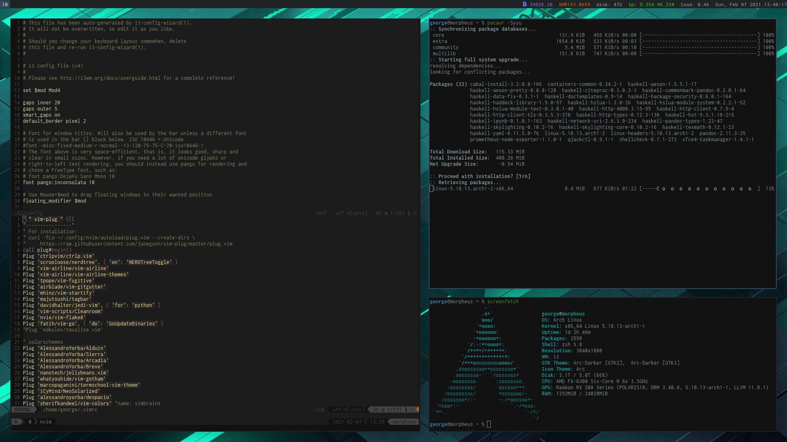

dotfiles
========

My various dotfiles



## Usage

The `configure` script is meant to work with **zsh only**.

clone the repo:
```bash
cd
git clone https://github.com/gangelop/dotfiles.git
```
To install the dotfiles and **OVERWRITE** those in your home directory run:
```bash
source dotfiles/configure
```

When I make a change to a dotfile, I use the `todot` script to quicky copy it to the right location within the dotfile repo.  
Example:
```bash
todot .i3/config .config/compton.conf
```

Then it's ready to be commited to git.

## Extra stuff, not in the public repo.

Extra stuff that can or should be out of the public repository, can be
included in a `~/.extra` file, which is sourced from `~/.zshrc`.

example:
```bash
# Stuff that's not in the dotfile repository

# git credentials
GIT_AUTHOR_NAME="George Angelopoulos"
GIT_COMMITTER_NAME="$GIT_AUTHOR_NAME"
git config --global user.name "$GIT_AUTHOR_NAME"
GIT_AUTHOR_EMAIL="george@usermod.net"
GIT_COMMITTER_EMAIL="$GIT_AUTHOR_EMAIL"
git config --global user.email "$GIT_AUTHOR_EMAIL"
git config --global user.signingkey "BB60108E"
```

## Thanks to...

* [Mathias Bynens](https://github.com/mathiasbynens/) and his [dotfiles repo](https://github.com/mathiasbynens/dotfiles)
